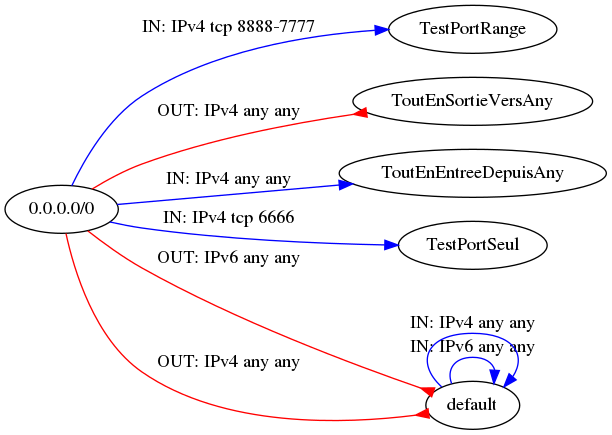
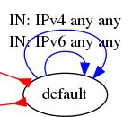
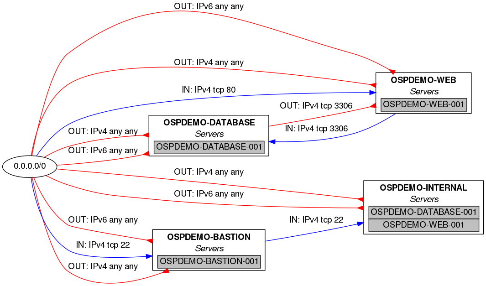
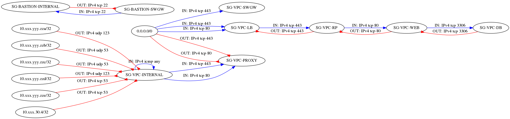
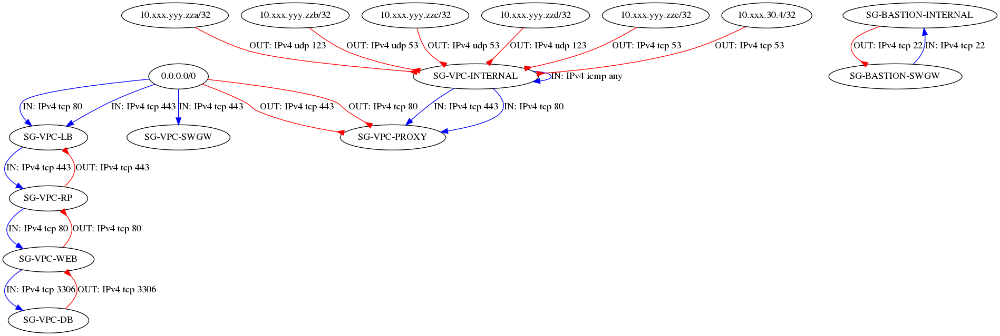

# aws-securitygroup-grapher

This ansible role gets information from an aws VPC and generate a [graphical representation](CloudGrapher.png) of security groups through a dot file rendered by [Graphviz](https://graphviz.gitlab.io/).

This role is inspired by https://github.com/jeanlouisferey/openstack-securitygroup-grapher which do the same for Openstack Tenants.

## Requirements

[Ansible](https://www.ansible.com/), of course, because it's an Ansible role.

[Boto](https://aws.amazon.com/fr/sdk-for-python/) library needs to be installed, as that is required by the EC2 Ansible modules.

To render (i.e. to draw and obtain a graphic file), Graphviz needs to be installed.

## Role Variables

| Variable | Content |
| --- | --- |
| **asggrapherAwsRegion** | Name of aws region where your VPC is deployed. (**mandatory**) |
| **asggrapherAwsVPC** | Name of your VPC. (**mandatory**) |   |   |
| asggrapherShowDefault | Do you want to see default security group, default value: false |
| asggrapherShowInstances | Do you want to see instances with their security groups, default value: false |
| asggrapherServerLabel | Label for instances, used when asggrapherShowInstances = true, default value: Servers |
| asggrapherRankdir | See <https://www.graphviz.org/doc/info/attrs.html#d:rankdir>, default value: LR |
| asggrapherDotFileToRender | Path and name of generated dot file , default value: "./awsCloudGrapher.dot" |
| asggrapherFileToRender | Path and name of generated image file, default value: "./awsCloudGrapher.png" |

## Example Playbook

aws-sg-grapher.yml:
~~~yaml
---
  - name: AWS Security group grapher
    hosts: localhost
    connection: local
    gather_facts: false
    roles:
      - role: aws-securitygroup-grapher
        asggrapherAwsRegion: "eu-west-1"
        asggrapherAwsVPC: "TEST-VPC"
~~~

Run it with:

~~~shell
ansible-playbook aws-sg-grapher.yml
~~~

After some time, you'll have a awsCloudGrapher.png file with your sg graph.

## Examples of generated images

### How to read the graph

Ellipses are *security groups.*

The red arrows represent *egress* flows: for example, the UDP stream 53 is authorized as output of SG-VPC-INTERNAL to 10.xxx.yyy.zza.

The blue arrows represent *ingress* flows: for example, tcp stream 443 is allowed as input of SG-VPC-LB from any (0.0.0.0/0)

The arrow head is always on the security group which contains the rule represented by the arrow.

### Full example

*It shows a tenant with several security groups corresponding to the different functions of the machines present in the project.*

### Simpler example

*It shows in particular a SG that accepts any input from any source and a SG that allows any output to any destination.*

### asggrapherShowDefault

With asggrapherShowDefault: true, you'll have on your graph all the SGs, included the default AWS SG:

### asggrapherShowInstances

With asggrapherShowInstances: true, you'll have on your graph all the instances (VM) within SGs used by these instances.

### asggrapherRankdir

With asggrapherRankdir: LR, left to right, RL, right to left, TB, top to bottom, BT, bottom to top, you can change the way to draw the graph.

#### LR example

#### TB example

### Author Information

Jean-Louis FEREY
